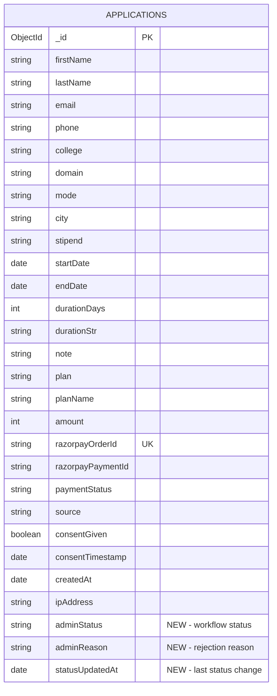

# feat: Admin Dashboard for Application Management

## Overview

Build a password-protected admin dashboard at `/admin` for the CertifyBridge team (2-5 operators) to view, filter, manage, and export internship applications. The dashboard follows the existing vanilla HTML/CSS/JS architecture — no frameworks, no build step — and integrates with the existing MongoDB collection and Resend email infrastructure.

(see brainstorm: `docs/brainstorms/2026-03-16-admin-dashboard-brainstorm.md`)

## Problem Statement / Motivation

After payment, applications sit in MongoDB with no operator visibility or workflow management. The team currently has no way to:
- View submitted applications
- Track application status through a review pipeline
- Notify applicants of approval, rejection, or certificate issuance
- Export application data for offline processing

This blocks the core business operation: processing paid internship applications into delivered certificates.

## Proposed Solution

A self-contained admin page (`public/admin.html`) backed by 3 new API routes (`api/admin/`), sharing auth through a reusable middleware (`lib/adminAuth.js`). Status-change emails handled by `lib/admin-emails.js`. All consistent with existing patterns — no new dependencies, no framework.

## Technical Approach

### Architecture

```
public/admin.html          ← Vanilla JS dashboard (dark theme, design system)
  ↓ fetch() with Bearer token
api/admin/applications.js  ← GET: paginated list with filters
api/admin/applications/[id].js ← PATCH: update status + trigger email
api/admin/export.js        ← GET: CSV download
  ↓
lib/adminAuth.js           ← requireAdmin() middleware
lib/admin-emails.js        ← Status-change email templates (Resend)
lib/admin-transitions.js   ← Valid status transition map
lib/mongodb.js             ← Updated ensureIndexes() with admin compound index
```

### Data Model Changes

No new collections. Add `adminStatus` field to existing `applications` documents:

```
applications document (additions):
  adminStatus:      String  ('paid'|'under_review'|'approved'|'rejected'|'certificate_issued')
  adminReason:      String  (optional, for rejection reason)
  statusUpdatedAt:  Date    (when adminStatus last changed)
```

**Legacy document handling:** Existing documents have no `adminStatus` field. The API treats `adminStatus: null/undefined` as equivalent to `paid`. No migration script needed — the field is set on first status update via `$set`.



### Status Transition Map

Strict linear workflow with no backward transitions. Both `certificate_issued` and `rejected` are terminal states.

```js
// lib/admin-transitions.js
const TRANSITIONS = Object.assign(Object.create(null), {
  paid:               ['under_review'],
  under_review:       ['approved', 'rejected'],
  approved:           ['certificate_issued'],
  rejected:           [],           // terminal
  certificate_issued: [],           // terminal
});
```

Decision: No backward transitions. If an admin makes a mistake, they must escalate outside the system. This keeps the workflow simple and prevents email re-sends. (see brainstorm: key decision #2)

### Implementation Phases

#### Phase 1: Backend Foundation

**Files to create:**

1. **`lib/adminAuth.js`** (~15 lines)
   - Export `requireAdmin(req, res)` → returns `true` if authorized, sends 401 and returns `false` otherwise
   - Reads `Authorization: Bearer <token>` header
   - Compares against `process.env.ADMIN_TOKEN` using `crypto.timingSafeEqual` (consistent with Razorpay signature verification pattern)
   - Rate limit: reuse `checkRateLimit(ip, { max: 30, windowMs: 60_000, key: 'admin' })`

   ```js
   // lib/adminAuth.js
   import crypto from 'crypto';
   import { checkRateLimit } from './rate-limit.js';

   export function requireAdmin(req, res) {
     const ip = (req.headers['x-forwarded-for'] || '').split(',')[0].trim() || 'unknown';
     if (!checkRateLimit(ip, { max: 30, windowMs: 60_000, key: 'admin' })) {
       res.setHeader('Retry-After', '60');
       res.status(429).json({ error: 'Too many requests.' });
       return false;
     }
     const token = process.env.ADMIN_TOKEN;
     if (!token) {
       console.error('[adminAuth] ADMIN_TOKEN not configured');
       res.status(500).json({ error: 'Admin access not configured.' });
       return false;
     }
     const auth = (req.headers.authorization || '').replace(/^Bearer\s+/i, '');
     if (!auth) {
       res.status(401).json({ error: 'Authorization required.' });
       return false;
     }
     const a = Buffer.from(auth);
     const b = Buffer.from(token);
     if (a.length !== b.length || !crypto.timingSafeEqual(a, b)) {
       res.status(401).json({ error: 'Invalid token.' });
       return false;
     }
     return true;
   }
   ```

2. **`lib/admin-transitions.js`** (~15 lines)
   - Export `TRANSITIONS` map and `isValidTransition(from, to)` helper
   - Export `STATUS_LABELS` for display names and `STATUS_COLORS` for badge colors

3. **`lib/admin-emails.js`** (~200 lines)
   - Export `sendApprovalEmail(doc)`, `sendRejectionEmail(doc, reason)`, `sendCertificateIssuedEmail(doc)`
   - Follow existing Resend pattern: `new Resend(process.env.RESEND_API_KEY)`, both `text` and `html` bodies
   - Reuse `he()` HTML escaper (extract from `verify-payment.js` or duplicate — small enough to duplicate)
   - Email map: `{ approved: sendApprovalEmail, rejected: sendRejectionEmail, certificate_issued: sendCertificateIssuedEmail }`
   - All emails are fire-and-forget — return `{ sent: true/false }` for the API response

**Files to modify:**

4. **`lib/mongodb.js`** — update `ensureIndexes()`:
   - Add compound index: `{ adminStatus: 1, plan: 1, createdAt: -1 }` (covers filtered + sorted queries)
   - Add index: `{ firstName: 1, lastName: 1, email: 1 }` (supports text search fallback)

#### Phase 2: API Routes

5. **`api/admin/applications.js`** — `GET /api/admin/applications`
   - Auth: `if (!requireAdmin(req, res)) return;`
   - Method gate: GET only
   - Query params: `page` (default 1), `limit` (fixed 25), `plan`, `status`, `search`, `dateFrom`, `dateTo`
   - MongoDB query construction:
     - `plan` filter: `{ plan: planValue }` if not "all"
     - `status` filter: `{ adminStatus: statusValue }` — special case: `paid` matches `{ $in: ['paid', null] }` for legacy docs
     - `search` filter: case-insensitive `$regex` on `firstName`, `lastName`, `email`, `college`, `razorpayOrderId` combined with `$or`
     - `dateFrom`/`dateTo`: `{ createdAt: { $gte: dateFrom, $lte: dateTo } }` (filter on `createdAt`)
     - All filters AND-combined
   - Sort: `{ createdAt: -1 }` (newest first)
   - Pagination: offset-based `skip((page-1)*limit).limit(limit)`
   - Response: `{ applications: [...], total, page, totalPages }`
   - Projection: exclude `ipAddress`, `consentTimestamp`, `razorpaySignature`
   - Log: `[admin/applications]` prefix

6. **`api/admin/applications/[id].js`** — `PATCH /api/admin/applications/:id`
   - Auth: `if (!requireAdmin(req, res)) return;`
   - Method gate: PATCH only
   - `id` param: MongoDB `_id` as hex string (validated with `/^[0-9a-f]{24}$/`)
   - Body: `{ status: String, reason?: String, expectedStatus?: String }`
   - **Optimistic concurrency:** If `expectedStatus` is provided, the update query includes `{ adminStatus: { $in: [expectedStatus, ...(expectedStatus === 'paid' ? [null] : [])] } }`. If `matchedCount === 0`, return 409 Conflict.
   - Transition validation: `isValidTransition(currentStatus, newStatus)` — reject with 400 if invalid
   - MongoDB update: `$set: { adminStatus, statusUpdatedAt, adminReason? }`
   - Email trigger: look up the email function from the email map, call fire-and-forget
   - Webhook-only records (no email field): skip email, include warning in response
   - Response: `{ success: true, emailSent: true/false, warning?: "No email on file" }`
   - Rate limit: `{ max: 10, windowMs: 60_000, key: 'admin-update' }`

7. **`api/admin/export.js`** — `GET /api/admin/export`
   - Auth: `if (!requireAdmin(req, res)) return;`
   - Method gate: GET only
   - Same filter params as list endpoint (plan, status, search, dateFrom, dateTo)
   - Query MongoDB with filters, no pagination (but cap at 5000 rows to avoid timeout)
   - Build CSV server-side:
     - UTF-8 BOM (`\uFEFF`) prepended for Excel compatibility
     - RFC 4180 escaping: fields containing commas, quotes, or newlines wrapped in double quotes; internal quotes doubled
     - Deterministic column order (brainstorm decision)
     - Exclude: `ipAddress`, `_id`, `consentTimestamp`, `razorpaySignature`
   - Response headers: `Content-Type: text/csv; charset=utf-8`, `Content-Disposition: attachment; filename="certifybridge-applications-YYYY-MM-DD.csv"`
   - `maxDuration: 15` in vercel.json (export may be slower than standard queries)

#### Phase 3: Frontend Dashboard

8. **`public/admin.html`** (~600-800 lines, single self-contained file)

   **Design system** (reuse from `apply.html`):
   - Same CSS variables: `--bg`, `--bg-card`, `--border`, `--text`, `--muted`, `--dim`, `--mono`, `--font`
   - Same fonts: Inter (400/500/700/800/900), Inter Display (700), Fragment Mono
   - Brand accent: `#0000ee`
   - Corner bracket decorations on containers
   - Monospace uppercase labels with `//` prefix
   - Glass-morphism cards: `backdrop-filter: blur(8px)`, semi-transparent borders

   **Sections:**

   **A. Token Entry Screen**
   - Centered card with corner brackets
   - `// ADMIN ACCESS` label
   - Password input + "Enter" button
   - On submit: `fetch('/api/admin/applications', { headers: { Authorization: 'Bearer ' + token } })`
   - If 200: store token in `sessionStorage.setItem('adminToken', token)`, show dashboard
   - If 401: show error "Invalid token"

   **B. Dashboard Header**
   - Logo: `// certifyBridge [admin]`
   - Export CSV button (top-right): `[Export ↓]`

   **C. Filter Bar**
   - Plan dropdown: All / Noob / Pro / Hacker
   - Status dropdown: All / Paid / Under Review / Approved / Rejected / Certificate Issued
   - Search text input (debounced 300ms)
   - Date range: From / To date inputs
   - Each filter change resets page to 1 and re-fetches

   **D. Application Table**
   - Columns: Name, Email, Plan, Status (color badge), Date, Action (→)
   - Status badges with color coding:
     - `paid`: dim gray
     - `under_review`: yellow/amber
     - `approved`: green
     - `rejected`: red
     - `certificate_issued`: blue (#0000ee)
   - Rows clickable → opens detail panel
   - Empty state: "No applications found" message when results are empty

   **E. Pagination**
   - `[< Prev]  Page X of Y  [Next >]`
   - Prev disabled on page 1, Next disabled on last page

   **F. Slide-Out Detail Panel**
   - Opens from right side (fixed position, overlay)
   - Close button (×) top-right
   - Full application data in label:value pairs using Fragment Mono
   - Status dropdown (only valid next transitions shown)
   - Reason textarea (visible only when "rejected" is selected)
   - "Update Status" button
   - Loading state during PATCH request
   - Success/error feedback inline
   - On success: close panel, refresh table row

   **G. Global UI States**
   - Loading spinner during API calls
   - 401 response interceptor: clear sessionStorage, show token entry screen
   - Error toast for unexpected failures

   **JS Architecture:**
   - All functions global (no modules, matching `apply.html` pattern)
   - `getToken()` → reads from sessionStorage
   - `apiFetch(path, options)` → wrapper that adds `Authorization` header and handles 401 redirect
   - `loadApplications()` → fetch + render table
   - `openDetail(id)` → fetch single app + render slide-out
   - `updateStatus(id, status, reason, expectedStatus)` → PATCH + handle response
   - `exportCSV()` → trigger download
   - Debounced search with `setTimeout`/`clearTimeout`

#### Phase 4: Configuration & Dev Server

9. **`vercel.json`** updates:
   - Route: `{ "src": "/admin", "dest": "/admin.html" }`
   - Functions:
     ```json
     "api/admin/applications.js":      { "maxDuration": 10 },
     "api/admin/applications/[id].js": { "maxDuration": 10 },
     "api/admin/export.js":            { "maxDuration": 15 }
     ```
   - CSP for admin page (tighter than apply — no Razorpay):
     ```json
     {
       "source": "/admin",
       "headers": [{
         "key": "Content-Security-Policy",
         "value": "default-src 'self'; script-src 'self' 'unsafe-inline'; style-src 'self' 'unsafe-inline' https://fonts.googleapis.com; font-src https://fonts.gstatic.com; connect-src 'self'; img-src 'self' data:; form-action 'self'; base-uri 'self'; object-src 'none'"
       }]
     }
     ```
   - Cache-Control for `admin.html`: `public, max-age=0, must-revalidate`

10. **`server.js`** updates:
    - Replace flat `readdirSync(apiDir)` with recursive directory walk
    - Map nested paths: `/api/admin/applications` → `handlers['admin/applications']`
    - Handle Vercel-style dynamic routes: `/api/admin/applications/abc123` → `handlers['admin/applications/[id]']` with `req.query.id = 'abc123'`
    - Add `/admin` to static route mapping (alongside `/apply`)

11. **`.env.example`** updates:
    - Add `ADMIN_TOKEN=` with comment explaining usage

## System-Wide Impact

### Interaction Graph

- Admin opens `/admin` → static HTML served by Vercel/server.js
- Token entry → `GET /api/admin/applications` with Bearer header → `requireAdmin()` → MongoDB query → JSON response
- Status update → `PATCH /api/admin/applications/[id]` → `requireAdmin()` → validate transition → MongoDB `$set` → trigger email via `lib/admin-emails.js` → Resend API → JSON response
- CSV export → `GET /api/admin/export` → `requireAdmin()` → MongoDB query (all matching) → CSV serialization → file download

### Error Propagation

- Auth failure (401) → frontend clears sessionStorage, shows token screen
- Rate limit (429) → frontend shows "slow down" message
- MongoDB connection failure (500) → frontend shows "Service unavailable"
- Invalid transition (400) → frontend shows validation error in detail panel
- Concurrent update (409) → frontend refreshes detail panel, shows "Application was updated by another admin"
- Email failure → status change persists, response includes `emailSent: false`

### State Lifecycle Risks

- **Partial failure on status update:** MongoDB write succeeds but email fails → acceptable, status is the source of truth, email is best-effort
- **Legacy documents without `adminStatus`:** Handled via `$in: ['paid', null]` query — no orphaned state
- **SessionStorage cleared mid-session:** Next API call returns 401, graceful redirect to token screen

### API Surface Parity

Three new endpoints, all behind `requireAdmin()` middleware. No overlap with existing public endpoints. The existing `GET /api/application?orderId=` remains public and read-only (safe).

## Acceptance Criteria

### Functional Requirements

- [x] Admin can enter ADMIN_TOKEN and access the dashboard
- [x] Invalid token shows clear error message
- [x] Application list loads with all existing applications (including legacy docs without `adminStatus`)
- [x] Filters work: plan, status, search text, date range (all AND-combined)
- [x] Search is case-insensitive substring match on name, email, college, orderId
- [x] Pagination works with 25 items per page
- [x] Clicking a row opens slide-out detail panel with full application data
- [x] Status dropdown shows only valid next transitions
- [x] Reason textarea appears only when "rejected" is selected
- [x] Status update persists to MongoDB and triggers appropriate email
- [x] Optimistic concurrency: concurrent update returns 409 with clear message
- [x] CSV export downloads with current filters, UTF-8 BOM, RFC 4180 escaping
- [x] Export excludes sensitive fields (ipAddress, consentTimestamp)
- [x] All admin API routes return 401 for missing/invalid token
- [x] Rate limiting applied to all admin routes

### Non-Functional Requirements

- [x] Admin page matches CertifyBridge design system (dark theme, corner brackets, Fragment Mono)
- [x] No new npm dependencies required
- [x] All API routes use `crypto.timingSafeEqual` for token comparison
- [x] CSP headers configured for `/admin` page
- [x] Local dev server supports nested `api/admin/*` routes
- [x] Admin compound index added to MongoDB for query performance
- [x] Export capped at 5000 rows to prevent timeout
- [x] `maxDuration` configured for all admin functions in `vercel.json`

## Dependencies & Risks

| Risk | Mitigation |
|---|---|
| M0 free tier slow on unindexed queries | Add compound index `{ adminStatus: 1, plan: 1, createdAt: -1 }` |
| CSV export timeout on large datasets | Cap at 5000 rows, set `maxDuration: 15` |
| Token brute-force | Rate limit + high-entropy token requirement (document minimum 32 chars) |
| Concurrent admin updates | Optimistic concurrency via `expectedStatus` in PATCH body |
| Legacy docs missing `adminStatus` | Query with `$in: ['paid', null]` for `paid` filter |
| Webhook-only records (no email) | Skip email on status update, return warning in response |

## File Inventory

### New Files (8)

| File | Purpose | ~Lines |
|---|---|---|
| `lib/adminAuth.js` | Bearer token auth middleware | 25 |
| `lib/admin-transitions.js` | Status transition map + labels + colors | 30 |
| `lib/admin-emails.js` | Approval/rejection/certificate email templates | 200 |
| `api/admin/applications.js` | GET paginated + filtered application list | 100 |
| `api/admin/applications/[id].js` | PATCH status update + email trigger | 120 |
| `api/admin/export.js` | GET CSV export | 80 |
| `public/admin.html` | Admin dashboard SPA | 700 |
| `.env.example` update | Add ADMIN_TOKEN | 1 |

### Modified Files (3)

| File | Change |
|---|---|
| `lib/mongodb.js` | Add admin compound index to `ensureIndexes()` |
| `vercel.json` | Add route, functions, CSP, cache headers for admin |
| `server.js` | Recursive API handler loading + `/admin` static route + dynamic `[id]` param |

## Sources & References

### Origin

- **Brainstorm document:** [`docs/brainstorms/2026-03-16-admin-dashboard-brainstorm.md`](docs/brainstorms/2026-03-16-admin-dashboard-brainstorm.md) — Key decisions carried forward: single ADMIN_TOKEN auth, linear status workflow with email triggers, vanilla HTML dashboard consistent with apply.html, server-side CSV export.

### Internal References

- Handler pattern: `api/application.js` (simplest GET handler, template for admin routes)
- Email pattern: `api/verify-payment.js:312-496` (Resend integration, HTML escaping, fire-and-forget)
- Auth pattern: `api/verify-payment.js:101-135` (`crypto.timingSafeEqual` usage)
- MongoDB: `lib/mongodb.js` (connection singleton, `ensureIndexes()`)
- Design system: `public/apply.html:13-66` (CSS variables, fonts, dark theme)
- Rate limiting: `lib/rate-limit.js` (reusable for admin routes)
- Plans: `lib/plans.js` (null-prototype pattern for lookup objects)
